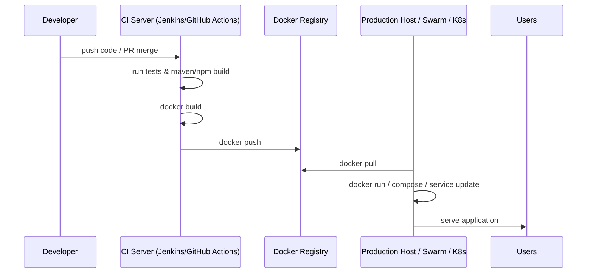
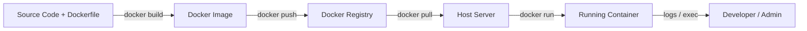

```markdown
# 🚀 Application Dockerization Guide

A concise, friendly guide that explains application architecture, tech stack, environments, Docker concepts, Dockerfiles, Docker Compose, Docker Swarm, and practical examples to help you containerize and run real-world applications (Java Spring Boot, Java web (WAR), Python Flask, React, etc.).

---

## 📚 Table of Contents
- [Overview](#overview)
- [Application Architecture](#application-architecture)
  - Architecture diagram
- [Tech Stack](#tech-stack)
- [Environments](#environments)
- [Why Docker?](#why-docker)
- [Docker Architecture & Flow](#docker-architecture--flow)
  - Dockerfile build/run flow diagram
- [Install Docker (Linux / EC2)](#install-docker-linux--ec2)
- [Common Docker Commands](#common-docker-commands)
- [Dockerfile Keywords (summary)](#dockerfile-keywords-summary)
- [Sample Dockerfiles](#sample-dockerfiles)
  - Java web (WAR)
  - Spring Boot (JAR)
  - Python Flask
  - React (multi-stage)
- [Copy-ready Commands](#copy-ready-docker-build--run-commands)
- [Pushing Images to Docker Hub](#pushing-images-to-docker-hub)
- [Docker Networks](#docker-networks)
- [Docker Compose](#docker-compose)
  - Example: Spring Boot + MySQL
- [Stateful vs Stateless & Docker Volumes](#stateful-vs-stateless--docker-volumes)
- [Docker Swarm (basic)](#docker-swarm-basic)
- [Useful Tasks](#useful-tasks)
- [Quick Git Upload Instructions](#quick-git-upload-instructions)
- [References & Example Repos](#references--example-repos)

---

## 📝 Overview
This README provides structured steps and examples to containerize your application and run it in development, QA, staging, or production environments using Docker, Docker Compose, and Docker Swarm. It includes copy/paste commands and diagrams to make onboarding and execution fast and reproducible.

---

## 🏗️ Application Architecture

High-level components:
- Frontend: User Interface (Angular 16)  
- Backend: Business logic (Java 17 / Spring Boot)  
- Database: MySQL Server 8.5  
- Webserver: Tomcat 9.0 (for WAR deployments)

Mermaid diagram (application flow):

```mermaid
%%{init: {"theme":"base","themeVariables":{"primaryColor":"#2b6cb0"}}}%%
graph LR
  A[Frontend (Angular 16)] -->|HTTP/REST| B[Backend (Java 17 / Spring Boot)]
  B -->|JDBC| C[MySQL 8.5]
  B -->|Deploy WAR| D[Tomcat 9.0]
  subgraph Users
    U[End Users]
  end
  U -->|Browser| A
```

---

## 🧩 Tech Stack
- Frontend: Angular 16  
- Backend: Java 17 (Spring Boot recommended)  
- Database: MySQL Server 8.5  
- Webserver: Tomcat 9.0 (for WAR)  
- Build tool: Maven (for Java examples)

Notes:
- To run the app without containers you'll need to install all dependencies locally: Java, Node/Angular CLI, MySQL, Tomcat, Maven, etc.  
- Docker simplifies this by packaging the app with its dependencies.

---

## 🌐 Environments
Common environments in real-world delivery:
1. DEV — code integration testing (developers)  
2. SIT — system integration testing (testers)  
3. UAT — user acceptance testing (client)  
4. PILOT — pre-production testing  
5. PROD — live production

As a DevOps engineer you set up infrastructure and install dependencies (or provide containerized workloads). Docker reduces version mismatch and installation issues across environments.

---

## 🐳 Why Docker?
- Containerization = package application code + runtime + dependencies  
- Portable across machines and environments  
- Consistent behavior between local, CI, and production  
- Faster onboarding and reproducible runtime

---

## 🏛️ Docker Architecture & Flow

Key concepts:
- Dockerfile — recipe describing how to build an image  
- Docker Image — immutable artifact containing code + runtime  
- Docker Registry — store for images (Docker Hub, private registries)  
- Docker Container — running instance of an image

### 🔁 Docker architecture (diagram)

```mermaid
flowchart LR
  SRC["Source Code"] -->|CI Build| BUILD["Build & Tests"]
  BUILD -->|artifact| ARTIFACT["Jar / WAR / Static"]
  ARTIFACT -->|docker build| IMAGE["Docker Image"]
  IMAGE -->|push| REGISTRY["Docker Registry"]
  REGISTRY -->|pull| HOST["Host Server"]
  HOST -->|docker run| CONTAINER["Docker Container"]
  CONTAINER -->|serve| USERS["End Users"]
```


### ⚙️ Process flow (CI → Registry → Deploy)


### 🔨 Build & run flow

---

## 🖥️ Install Docker (Linux / EC2)
Example for Amazon Linux (quick steps):

```bash
# Update & install docker
sudo yum update -y
sudo yum install docker -y
sudo service docker start

# Add ec2-user to docker group
sudo usermod -aG docker ec2-user

# Reconnect SSH (or logout/login), then verify
docker -v
```

Or install via the convenience script:

```bash
curl -fsSL https://get.docker.com -o get-docker.sh
sudo sh get-docker.sh
```

Enable required ports in cloud security groups (e.g., 8080, 5000, 2377 for Swarm, etc.).

---

## 🧰 Common Docker Commands

- docker images — list images  
- docker ps — list running containers  
- docker ps -a — list all containers  
- docker logs <container-id> — view logs  
- docker pull <image> — download image  
- docker rmi <image> — delete image  
- docker run <image> — create & run container  
- docker run -d -p 8080:8080 <image> — detached, port mapping  
- docker stop <container-id> — stop container  
- docker start <container-id> — start stopped container  
- docker rm <container-id> — remove container  
- docker exec -it <container-id> /bin/bash — open shell inside container  
- docker system prune -a — clean unused images/containers

Tip: Use `docker logs -f <name>` to follow logs in real time. ✅

---

## 🧾 Dockerfile Keywords (summary)
- FROM — base image (e.g., openjdk:17, python:3.6, tomcat:9.0)  
- LABEL — metadata (use instead of MAINTAINER)  
- RUN — executed during image build (install packages, build artifacts)  
- CMD — default command when the container runs (only last CMD used)  
- ENTRYPOINT — fixed entrypoint; CMD supplies default args  
- COPY — copy files from build context to image  
- ADD — similar to COPY, supports URLs and tar extraction  
- WORKDIR — set working directory  
- USER — run commands as a specific user  
- EXPOSE — document container port (does not publish it)

Note: Prefer LABEL over MAINTAINER (MAINTAINER is deprecated).

---

## 📦 Sample Dockerfiles

Java Web App (WAR + Tomcat):

```dockerfile
FROM tomcat:9.0
LABEL maintainer="Ashok"
EXPOSE 8080
COPY target/app.war /usr/local/tomcat/webapps/
```

Spring Boot (JAR):

```dockerfile
FROM openjdk:17
LABEL maintainer="Ashok"
COPY target/app.jar /usr/app/
WORKDIR /usr/app/
EXPOSE 8080
ENTRYPOINT ["java", "-jar", "app.jar"]
```

Python Flask:

```dockerfile
FROM python:3.6
LABEL maintainer="Ashok"
COPY . /usr/app/
WORKDIR /usr/app/
RUN pip install -r requirements.txt
EXPOSE 5000
ENTRYPOINT ["python", "app.py"]
```

React (multi-stage, served by nginx):

```dockerfile
# build stage
FROM node:18-alpine AS builder
WORKDIR /app
COPY package*.json ./
RUN npm ci
COPY . .
RUN npm run build

# production stage
FROM nginx:stable-alpine
COPY --from=builder /app/build /usr/share/nginx/html
EXPOSE 80
CMD ["nginx", "-g", "daemon off;"]
```

Build & run example:

```bash
# Build image (from project root)
docker build -t my-app-image .

# Run (map host port 8080 to container 8080)
docker run -d -p 8080:8080 my-app-image
```

---

## 📋 Copy-ready Docker build & run commands

### Spring Boot (JAR + Dockerfile.springboot)
```bash
# from repo root (where pom.xml and Dockerfile.springboot exist)
mvn clean package
docker build -f Dockerfile.springboot -t myorg/sb-app:latest .
# run (map host 8080 to container 8080)
docker run -d --name sb-app -p 8080:8080 myorg/sb-app:latest
# view logs
docker logs -f sb-app
# stop & remove
docker stop sb-app && docker rm sb-app
```

### Java Web (WAR + Tomcat)
```bash
mvn clean package
# build image using Dockerfile.tomcat (expects target/app.war or adjust)
docker build -f Dockerfile.tomcat -t myorg/tomcat-app:latest .
docker run -d --name tomcat-app -p 8080:8080 myorg/tomcat-app:latest
docker logs -f tomcat-app
```

### Python Flask
```bash
# Ensure requirements.txt and app.py present
docker build -f Dockerfile.python -t myorg/flask-app:latest .
docker run -d --name flask-app -p 5000:5000 myorg/flask-app:latest
docker logs -f flask-app
```

### React (production build served by nginx)
```bash
docker build -f Dockerfile.react -t myorg/react-app:latest .
docker run -d --name react-app -p 80:80 myorg/react-app:latest
# Open http://<host-ip>/
```

### Docker Compose (Spring Boot + MySQL)
```bash
# Compose will build the Spring app image and start both services (db persists under ./mysql-data)
docker-compose up -d --build
docker-compose ps
# stop
docker-compose down
```

---

## 📤 Pushing images to Docker Hub

```bash
# Login
docker login

# Tag an image
docker tag my-app-image <dockerhub-username>/my-app-image:latest

# Push
docker push <dockerhub-username>/my-app-image:latest
```

---

## 🌐 Docker Networks
Docker networks let containers communicate:

Default networks: bridge, host, none.  
Other options: overlay (for swarm), macvlan.

Commands:

```bash
docker network ls
docker network create my-net
docker network inspect my-net
docker run -d --network my-net --name app1 my-app-image
docker network rm my-net
```

---

## 🧱 Docker Compose
Manage multi-container apps with a single YAML file.

Example: Spring Boot + MySQL (docker-compose.yml):

```yaml
version: "3"
services:
  application:
    image: spring-boot-mysql-app
    build: .
    ports:
      - "8080:8080"
    networks:
      - springboot-db-net
    depends_on:
      - mysqldb
    volumes:
      - /data/springboot-app

  mysqldb:
    image: mysql:5.7
    networks:
      - springboot-db-net
    environment:
      - MYSQL_ROOT_PASSWORD=root
      - MYSQL_DATABASE=sbms
    volumes:
      - /data/mysql

networks:
  springboot-db-net:
```

Compose commands:

```bash
docker-compose up -d         # start services
docker-compose ps
docker-compose stop
docker-compose start
docker-compose down         # stop & remove containers
```

Install docker-compose (example):

```bash
sudo curl -L "https://github.com/docker/compose/releases/download/1.24.0/docker-compose-$(uname -s)-$(uname -m)" -o /usr/local/bin/docker-compose
sudo chmod +x /usr/local/bin/docker-compose
docker-compose --version
```

---

## 💾 Stateful vs Stateless Containers & Volumes
- Stateless container: data lost when container removed.  
- Stateful container: data persisted (use volumes).

Docker volume types:
- Anonymous volumes  
- Named volumes  
- Bind mounts  

Volume commands:

```bash
docker volume ls
docker volume create my-vol
docker volume inspect my-vol
docker volume rm my-vol
docker system prune --volumes
```

Example (binding host path in docker-compose):

```yaml
services:
  mysqldb:
    image: mysql:5.7
    volumes:
      - ./mysql-data:/var/lib/mysql
```

Make sure host directories have correct ownership/permissions.

---

## 🗂️ Docker Swarm (basic)
Docker Swarm is an orchestration platform (cluster of Docker nodes).

Initialize swarm on master:

```bash
sudo docker swarm init --advertise-addr <master-private-ip>
sudo docker swarm join-token worker  # get token
# On worker nodes:
sudo docker swarm join --token <token> <master-ip>:2377
```

Create service:

```bash
sudo docker service create --name java-web-app -p 8080:8080 ashokit/javawebapp
# Scale
sudo docker service scale java-web-app=3
# List services
sudo docker service ls
# Inspect
sudo docker service inspect --pretty java-web-app
# Remove
sudo docker service rm java-web-app
```

Ports: enable port 2377 (swarm communication) in security groups.

---

## ✅ Useful Tasks (Exercises)
- Task-1: Run Jenkins server using Docker (official jenkins/jenkins image)  
- Task-2: Setup MySQL DB using Docker and persist data via volumes  
- Task-3: Write Dockerfile to run a ReactJS app (build static assets, serve with nginx)

---

## 🔧 Quick Git Upload Instructions
To upload this README to your repository:

```bash
# from repo root
git add README.md
git commit -m "Add Dockerization README"
git push origin main    # adjust branch name if needed
```

---

## 🔗 References & Example Repos
- Java Web App example: https://github.com/ashokitschool/maven-web-app.git  
- Spring Boot Docker example: https://github.com/ashokitschool/spring-boot-docker-app.git  
- Python Flask Docker example: https://github.com/ashokitschool/python-flask-docker-app.git  
- Spring Boot + MySQL Compose demo: https://github.com/ashokitschool/spring-boot-mysql-docker-compose.git

---

## 💡 Final Tips & Good Practices
- Add a `.dockerignore` to keep build context small (ignore node_modules, target, .git, etc.).  
- Use non-root users in production images when possible.  
- Add HEALTHCHECK to Dockerfiles for production readiness.  
- Store secrets in environment variables or secret managers (do not hard-code them in images).  
- For production orchestration consider Kubernetes (K8s) for advanced use-cases.

---

If you want, you can add these to your Dockerfile:
- add a recommended `.dockerignore` file,
- add HEALTHCHECKs and non-root user steps to the Dockerfiles,

Happy containerizing! 🐳✨
```